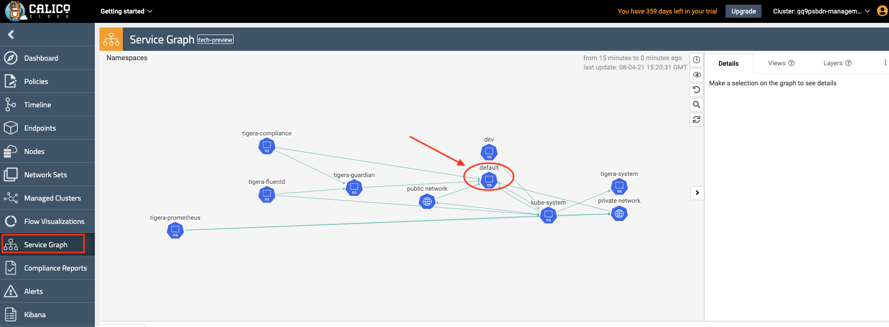
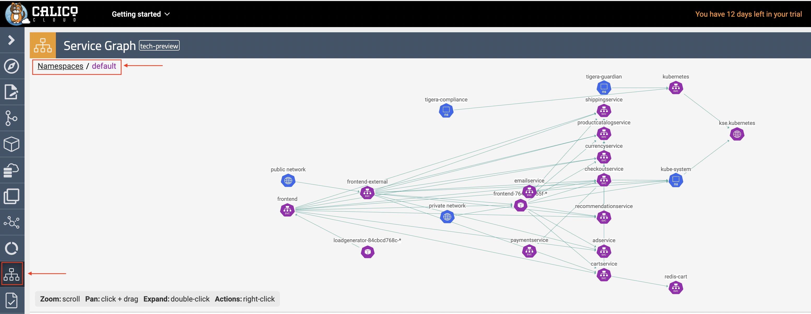

# Module 2: Configuring demo applications

**Goal:** Deploy and configure demo applications.

This workshop will deploy Namespace `dev` where several pods will be created to demonstrate connectivity within the Namespace and cross-Namespace to the `default` Namespace where the Boutiquestore (Microservices) Demo apps will be deployed. We will use a subset of these pods to demonstrate how Calico Network Policy can provide pod security and microsegmentation techniques. 
In [Module 9](../modules/anomaly-detection.md) we introduce Namespace `tigera-intrusion-detection` which contains specific Calico pods to run the Anomaly Detection engine.
<br>


## Steps

1. Confirm your current folder is in this repo.

   ```text
   jessie@Azure:~/calicocloud-aks-workshop$ pwd
   /home/jessie/calicocloud-aks-workshop
   ```


2. Deploy policy tiers.

    We are going to deploy some policies into policy tier to take advantage of hierarcical policy management.

    ```bash
    kubectl apply -f demo/tiers/tiers.yaml
    ```

    This will add tiers `security` and `platform` to the aks cluster. 


3. Deploy base policy.

    In order to explicitly allow workloads to connect to the Kubernetes DNS component, we are going to implement a policy that controls such traffic.

    ```bash
    kubectl apply -f demo/10-security-controls/allow-kube-dns.yaml
    ```

    This will add `allow-kube-dns` policy to your `platform` tier.
    

4. Deploy demo applications.

    ```bash
    # deploy dev app stack
    kubectl apply -f demo/dev/app.manifests.yaml

    # deploy boutiqueshop app stack
    kubectl apply -f demo/boutiqueshop/boutique-app.manifests.yaml
    ```
    
    ```bash
    #confirm the pod/deployments are running. Note the loadgenerator pod waits for the frontend pod to respond to http calls before coming up and can take a few minutes. Eventually, the status of the pods in the default namespace will look as follows: 
    
    kubectl get pods
    NAME                                     READY   STATUS    RESTARTS   AGE
    adservice-7cbc9bd9-jkjhq                 1/1     Running   0          86s
    cartservice-d7db78c66-4rw8p              1/1     Running   0          87s
    checkoutservice-784bfc794f-7np5p         1/1     Running   0          87s
    currencyservice-5898885559-74s5z         1/1     Running   0          86s
    emailservice-6bd8b47657-s4drk            1/1     Running   0          87s
    frontend-764c5c755f-8xjcs                1/1     Running   0          87s
    loadgenerator-84cbcd768c-6tcx5           1/1     Running   0          87s
    paymentservice-6c676df669-m5j6g          1/1     Running   0          87s
    productcatalogservice-7fcf4f8cc-nkvnd    1/1     Running   0          87s
    recommendationservice-79f5f4bbf5-qgqfv   1/1     Running   0          87s
    redis-cart-74594bd569-l4kt9              1/1     Running   0          86s
    shippingservice-b5879cdbf-r8xqb          1/1     Running   0          86s

    kubectl get pods -n dev
    NAME                         READY   STATUS    RESTARTS   AGE
    centos                       1/1     Running   0          48s
    dev-nginx-754f647b8b-99fsn   1/1     Running   0          48s
    dev-nginx-754f647b8b-hlrw8   1/1     Running   0          48s
    netshoot                     1/1     Running   0          48s
    ```

    The pods will be visible in "service graph", for example in `default` namespace. This may take 1-2 mins to update in Service Graph. To view resources in the `default` namespace click on the `Service Graph` icon on the left menu which will display a top level view of the cluster resources:
    <br>
    
    
    
    Double click on the `default` Namespace as highlighted to bring only resources in the `default` namespace in view along with other resources communicating into or out of the `deafult` Namespace.
    <br>
    
      

    Note that pod/resource limits on your nodes may prevent pods from deploying. Ensure the nodes in the cluster are scaled appropriately

5. Deploy compliance reports.

    >The reports run as cronjob and will be needed for one of a later lab.

    ```bash
    kubectl apply -f demo/40-compliance-reports/daily-cis-results.yaml
    kubectl apply -f demo/40-compliance-reports/cluster-reports.yaml
    ```

6. Deploy global alerts.

    >The alerts will be explored in a later lab. Ignore any warning messages - these do not affect the deployment of resources.

    ```bash
    kubectl apply -f demo/50-alerts/globalnetworkset.changed.yaml
    kubectl apply -f demo/50-alerts/unsanctioned.dns.access.yaml
    kubectl apply -f demo/50-alerts/unsanctioned.lateral.access.yaml
    ```

7. Install curl on loadgenerator pod
 
    > Before we implement network secruity rules we need to install curl on the loadgenerator pod for testing purposes later in the workshop. Note the installation will not survive a reboot so repeat this installation as necessary

    ```bash
    ##install update package and curl
    kubectl exec -it $(kubectl get po -l app=loadgenerator -ojsonpath='{.items[0].metadata.name}') -- sh -c 'apt-get update && apt install curl -y'
    ```

[Next -> Module 3](../modules/using-security-controls.md)
