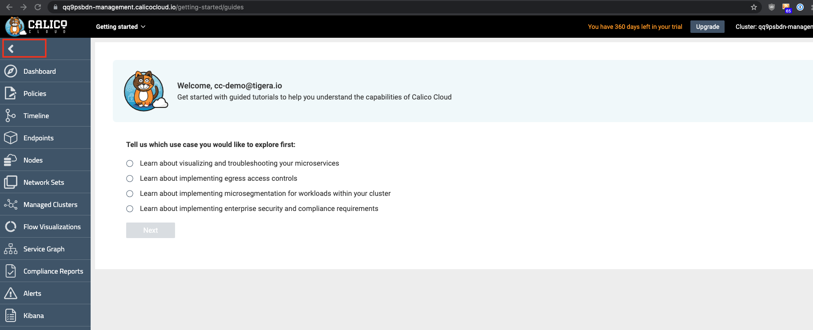
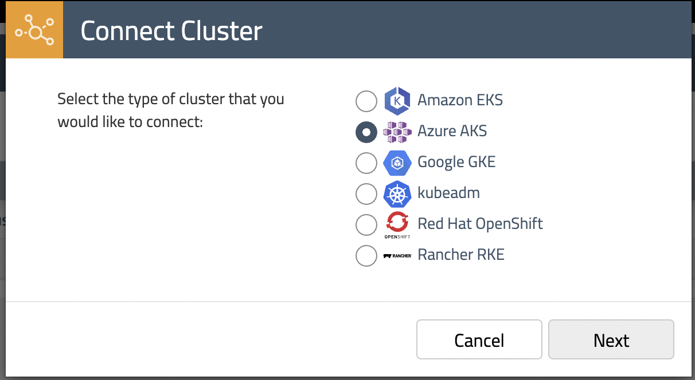
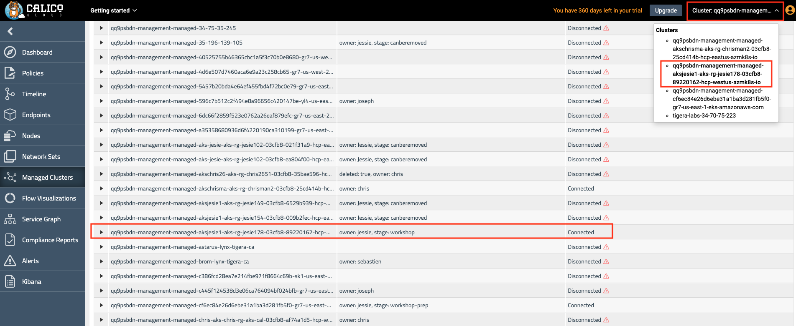

# Module 1: Joining AKS cluster to Calico Cloud

**Goal:** Join AKS cluster to Calico Cloud management plane.

IMPORTANT: In order to complete this module, you must have [Calico Cloud trial account](https://www.calicocloud.io/?utm_campaign=calicocloud&utm_medium=digital&utm_source=microsoft). Issues with being unable to navigate menus in the UI are often due to browsers blocking scripts - please ensure you disable any script blockers.

## Steps

1. Navigate to [https://www.calicocloud.io/?utm_campaign=calicocloud&utm_medium=digital&utm_source=microsoft](https://www.calicocloud.io/?utm_campaign=calicocloud&utm_medium=digital&utm_source=microsoft) and sign up for a 14 day trial account - no credit cards required. Returning users can login.

   

2. Upon signing into the Calico Cloud UI the Welcome screen shows four use cases which will give a quick tour for learning more. This step can be skipped. Tip: the menu icons on the left can be expanded to display the worded menu as shown:

   


3. Join AKS cluster to Calico Cloud management plane.
    
    Click the "Managed Cluster" in your left side of browser.
    
    
    Click on "connect cluster"
     

    Choose AKS and click next
      


    Run installation script in your aks cluster. 
    ```bash
    # script should look similar to this
    curl https://installer.calicocloud.io/xxxxxx_yyyyyyy-saay-management_install.sh | bash
    ```

    Joining the cluster to Calico Cloud can take a few minutes. Wait for the installation script to finish before you proceed to the next step.

    ```bash
    # output once your cluster join the calico cloud
    Install Successful

    Your Connected Cluster Name is qzmi9wp8-management-managed-xxxxxxxxxxxx-hcp-eastus-azmk8s-io
    ```
    Set the Calico Cluster Name as a variable to use later in this workshop. The Cluster Name can also be obtained from the Calico Cloud Web UI at a later date. For the example above `CALICOCLUSTERNAME` should be set to __arwb4wbh-management-managed-xxxxxxxxxxxxx-hcp-eastus-azmk8s-io__
    
    ```bash
    export CALICOCLUSTERNAME=<Cluster Name>

    #For Linux terminal
    echo export CALICOCLUSTERNAME=$CALICOCLUSTERNAME | tee -a ~/.bash_profile

    #For Mac terminal
    echo export CALICOCLUSTERNAME=$CALICOCLUSTERNAME | tee -a ~/.zshrc 
    ```
    
    In calico cloud management UI, you can see your own aks cluster added in "managed cluster", you can also confirm by
    ```bash
    kubectl get tigerastatus
    ```
    
    ```bash
    #make sure all customer resources are "AVAILABLE=True" 
    NAME                            AVAILABLE   PROGRESSING   DEGRADED   SINCE
    apiserver                       True        False         False      19h
    calico                          True        False         False      18h
    compliance                      True        False         False      19h
    intrusion-detection             True        False         False      19h
    log-collector                   True        False         False      19h
    management-cluster-connection   True        False         False      19h
    monitor                         True        False         False      19h
    ```
    
4. Navigating the Calico Cloud UI

    Once the cluster has successfully connected to Calico Cloud you can review the cluster status in the UI. Click on `Managed Clusters` from the left side menu and look for the `connected` status of your cluster. You will also see a `Tigera-labs` cluster for demo purposes. Ensure you are in the correct cluster context by clicking the `Cluster` dropdown in the top right corner. This will list the connected clusters. Click on your cluster to switch context otherwise the current cluster context is in *bold* font.
    
    

5. Configure log aggregation and flush intervals in aks cluster, we will use 10s instead of default value 300s for lab testing only.   

    ```bash
    kubectl patch felixconfiguration.p default -p '{"spec":{"flowLogsFlushInterval":"10s"}}'
    kubectl patch felixconfiguration.p default -p '{"spec":{"dnsLogsFlushInterval":"10s"}}'
    kubectl patch felixconfiguration.p default -p '{"spec":{"flowLogsFileAggregationKindForAllowed":1}}'
    ```

6. Configure Felix to collect TCP stats - this uses eBPF TC program and requires miniumum Kernel version of v5.3.0. Further [documentation](https://docs.tigera.io/v3.9/visibility/elastic/flow/tcpstats)
    >[Felix](https://docs.tigera.io/reference/architecture/overview#felix) is one of the Calico components that is responsible for configuring routes, ACLs, and anything else required on the host to provide desired connectivity for the endpoints on that host.

    ```bash
    kubectl patch felixconfiguration default -p '{"spec":{"flowLogsCollectTcpStats":true}}'
    ```

[Next -> Module 2](../modules/configuring-demo-apps.md)
